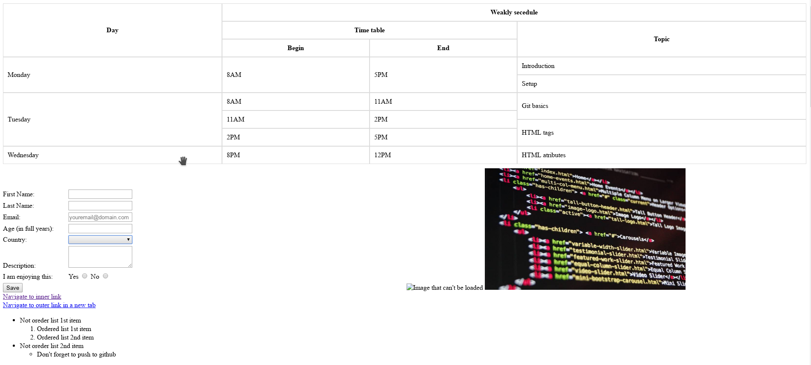

### HTML atributes
```HTML
<tag attribut="value" attibute2="othervalue" attribute3>
  Content
</tag>
````

* Types of attributes:

    * global
    * tag specific
    * custom (also global) - data-your-attribute
    * event spacific (on visible elements)
* attributes change the way elements are displayed and handled in the browser
* some of the attribute added effects can be handled with css or the effect can't be styled with css

### Global

* id - Sets a unique id for an element
* class - Sets one or more classnames for an element (refers to a class in a style sheet)
* style - Sets an inline CSS style for an element
* hidden - Sets that an element is not yet, or is no longer, relevant
* lang - Sets the language of the element's content
* tabindex - Sets the tabbing order of an element
* title - Sets extra information about an element
* contextmenu - Sets a context menu for an element. The context menu appears when a user right-clicks on the element (Fire fox example - https://www.w3schools.com/tags/tryit.asp?filename=tryhtml5_global_contextmenu)
* etc. 

### Tag specific

* value (button, input, li, option, meter, progress, param) - describes elements value, usually not the same as visible part
* required (input, select, textarea) - refering to form, if this imput is required (filled) for the form to be valid
* readonly (input, textarea) - data can be only seen not edited, but the input is shown as an input
* placeholder (input, textarea) - text that shows visually before the input has been filled
* pattern (input) - specifie input validation
* min, max (input) - sets the min/max value for the input
* disabled -  if the input is disabled, similar to read only with some specific changes

* rowspan (td, th) - how many rows are merged together in a table
* colspan (td, th) - how many columns are merged together in a table

* src (audio, embed, iframe, img, input, script, source, track, video) - sets the URL of the media file to use
* href (a, area, base, link) - sets the URL that the page goes to when used
* alt (area, img, input)- alternate text when the original element fails to display (if input type is outdated, media does not load)

### List of all attributes, the usage and description

https://html-css-js.com/html/tutorial/html-tag-attributes.php
https://www.cs.princeton.edu/courses/archive/fall07/cos109/labs/html/tags.html

### HTML check up task
create page using only html and it's atributes based on the image under your usernam.github.io project and push it to github.



[Solution](extra-resources/index.html)