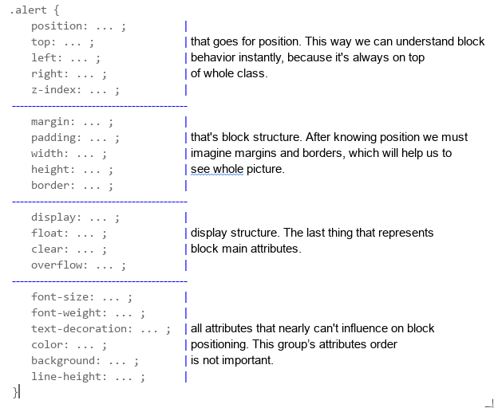

### Box model


* From inner to outer level
    * width X height
    * padding
    * border
    * margin

* Best practices
    * Order your code based on one structure
    

    * Group related selectors
        * Bad example
        ```CSS
        .header {
            font-size: 24px        }
        table td { text-align: center}
        table {table-layout: fixed; border-spacing: 0      }
        form {
            color: red;
        }
        .first-class { background: #FFF000
        }
        table > tr {
            height: 50px;
        }
        td:hover{border: 1px solid #000000;}
        ```

        * Good example

        ```CSS
        table {
            table-layout: fixed;
            border-spacing: 0
        }
        table > tr {
            height: 50px;
        }
        table td {
            text-align: center;
        }
        table td:hover {
            border: 1px solid #000000;
        }
        form {
            color: red;
        }
        .first-class { 
            background: #FFF000;
        }
        .header {
            font-size: 24px;    
        }
        ```
### Full property guideline and real life usage (only desktop based)

1. fixed navigation bar at the top with extra buttons
    * some type of logo that leads to homepage
    * navigation element hover opens child menu
    * outer link(s)
    * inner link(s)

2. Product registration form
    * Form heading
    * Name (text input), required
    * Category (select), required
    * Price (number), required
    * In stock amount (number)
    * description
    * can be sold (checkbox)
    * Submit, clear button

3. Table based on form data
    * Styled for better looks
    * ID colum
    * Action (edit, delete) column

4. A popup that that asks us for delete confirmation
