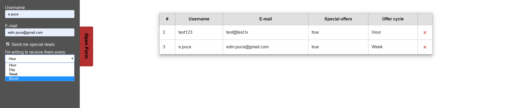
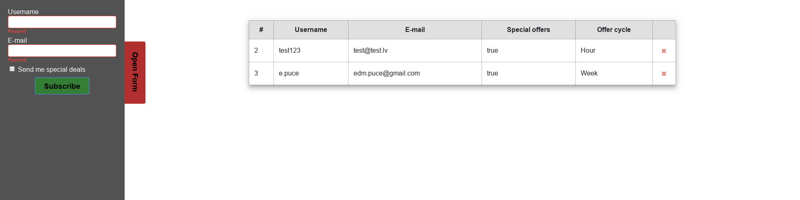
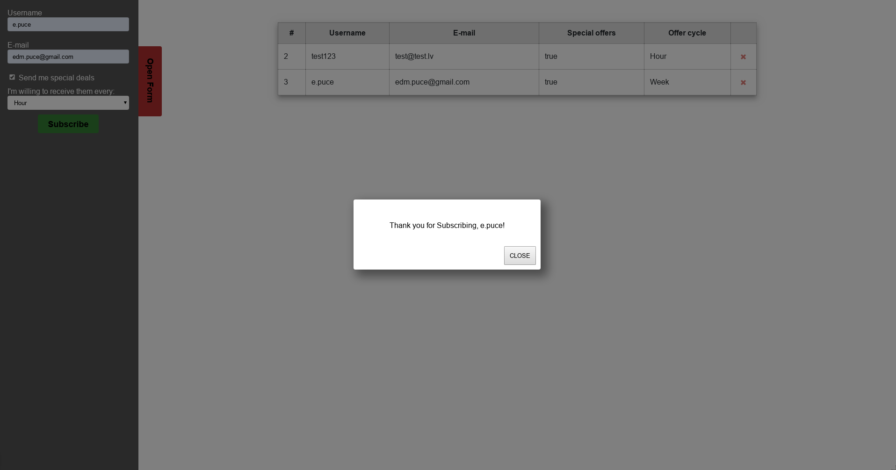

## Crate a landing page based on these rules
1. Create a button that shows a form (it can slid from the side, be shown in the main html or as a popup)
2. Add minimum 4 different form fields, make one be visible only on some type of conditions (if one form field has been filled, checkbox selected, select field appropriate value selected)
3. Validate minimum two of the fields (on button click point nr.4), show a visual representation if fields ar not valid
    * Error messages for not valid fields will be treated as a **bonus**
4. Add a button that triggers the validation
    * If you find out a way how to save the data somewhere - it will be treated as a **bonus**
5. If Validation passes show a popup with a full screen backdrop that contains some type of message with some data from the form (like: "thank you, username, we have received your request")
6. Add a button to the popup that closes it
7. Create a table where the data from the form will be shown, add an ID column and actions column that contains a delete button
   * If you did not think about a way to save the data, create 10 fake static records
   * If you saved the data somewhere, show it dynamically, make an action that can delete each individual record
8. Push the final product to github and post it in google classroom under the assignment

## Example (it's more like inspiration and visual task representation)

### What to take in account
1. Clean code styling (spaces, new lines, variable placement, nesting, don't repeat yourself)
2. Appropriate HTML tag and attribute usage, logical class, id, etc. naming
3. Structured CSS
   * all corresponding styles ar written together
   * logical property sequence
4. JavaScript variable naming/declaration logic
5. clean and easy to read JavaScript functions (logically structured)
6. Visual appearance (good background/text contrast, readable content, no overlapping)
7. Any additional functionality and implementations will be treated as **bonus** 