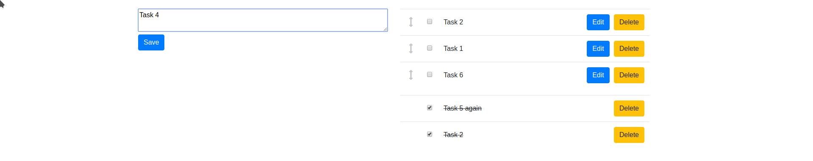
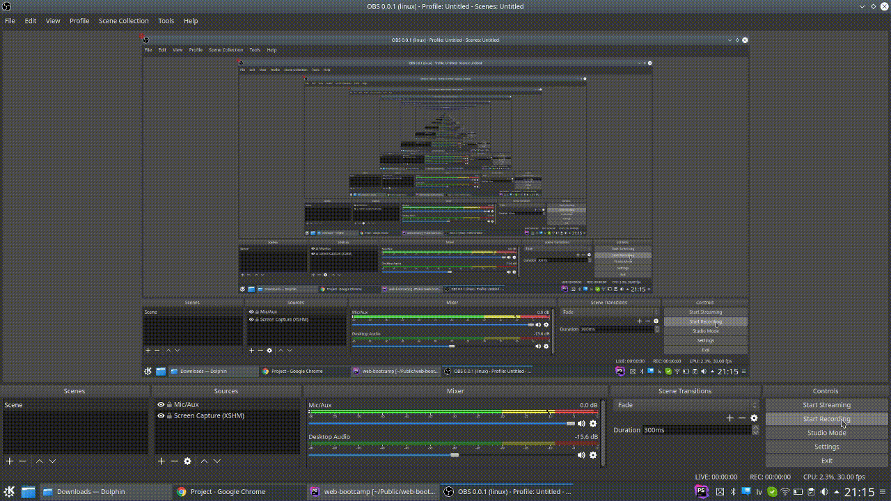

### Create  a todo list
1. Create a page where we show a input field where we can add a to-do item
2. When submitted the item is shown in a list under the input
3. Before the item, there is a checkbox, when checked - the item goes to a second list under the first one. This action can be reversed.
4. Add the possibility to delete the items (from both lists)
5. Add the possibility to edit an existing item (from not checked list)

    ###Extra:

6. Allow to order the items in unchecked list
7. Add a login page and track the list based on the user

### Example

### Things to note
1. Data has to be saved to a database
2. Show the best skills you have in all the addressed topics (front-end, back-end, database);
3. Use clean code styling (spaces, new lines, variable placement, nesting, don't repeat yourself)
3. Appropriate HTML tag and attribute usage, logical class, id, etc. naming
4. Structured CSS
5. Easy to read/understand PHP & SQL

# You will show a working system in the last lesson by explaining/showing the "engine" under it
# Say some words about challenges/obstacles on the way