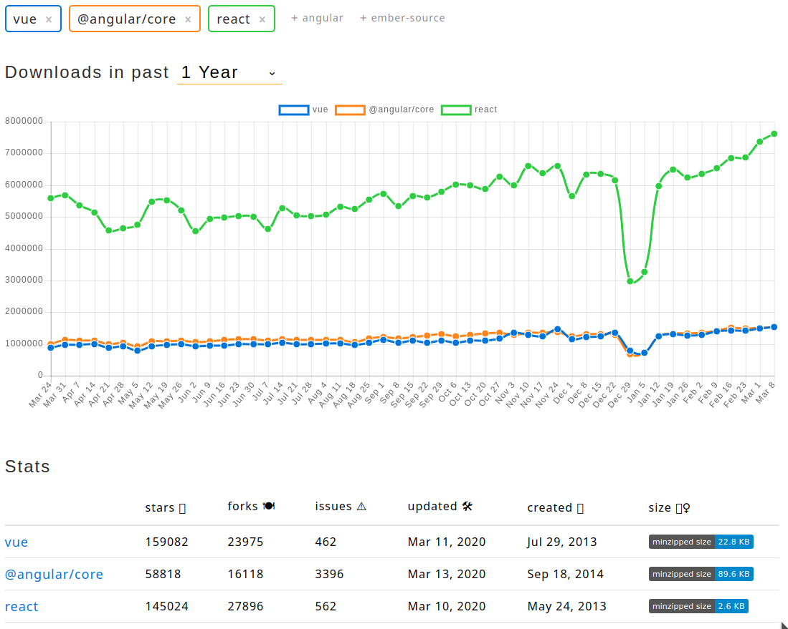

## How to choose
* Which is better for my next web app development project?
* Which framework or library offers the best performance?
* Which is the most suitable for me?
* What is virtual DOM?

### Vue - Based on AngularJS/Angular
* Installation
  * direct link - `<script src="https://cdn.jsdelivr.net/npm/vue/dist/vue.js"></script>`
  * node package manager - npm install vue
    * import the file as you would any other. `node_modules/vue/dist/vue.js` file

* vue specific commands start with "v-"
  * v-bind:title
  * v-on:click
  * v-model
* examples - [link](https://vuejs.org/v2/examples/svg.html) 

* Fiddle - [link](https://jsfiddle.net/chrisvfritz/50wL7mdz/)

```HTML
<div id="body-wrapper">
  <h1>{{ heading }} {{ clickCount || ''}}</h1>

  <button v-on:click="addCount">Add one</button>

  <my-btn text="This is my btn"></my-btn>
</div>
```
```JavaScript
Vue.component('my-btn', {
  props: {
    text: {
      type: String,
      default: ''
    },
  },
  methods: {
    changeText: function() {
			this.extraText = "The btn was clicked"
    }
  },
  data() {
   return {
       extraText: ""
   };
  },
  template: `
		<span>
      <button v-on:click="changeText">{{ text }}</button>
    	{{ extraText }}
    </span>
  `
})

new Vue({
  el: '#body-wrapper',
  data: {
    heading: 'This is how Vue binds data to html',
    clickCount: 0
  },
  methods: {
    addCount: function() {
    	this.clickCount ++;
    }
  }
})
```

### React - Facebook created
* Installation
  * direct link:
  ```html
  <!-- head -->
  <script crossorigin src="https://unpkg.com/react@16/umd/react.production.min.js"></script>
  <script crossorigin src="https://unpkg.com/react-dom@16/umd/react-dom.production.min.js"></script>
  <script src="https://unpkg.com/babel-standalone@6/babel.min.js"></script>

  <!-- after body -->
  <script type = "text/babel" src="./your-react-js-file.js"></script>
  ```
  * `npx create-react-app my-app-name` (npx is an npm package runner)
    * This crates the full app structure and will behave different from just importing the files

* Fiddle - [link](https://jsfiddle.net/reactjs/69z2wepo/)

```JavaScript
(function() {
  class CompHtml extends React.Component {

    constructor(props) {
      super(props);
      this.count = 0;
      this.onClick = this.onClick.bind(this);
    }

    onClick() {
      this.setState(() => this.count += 1);
    }

    render() {
      return (
      <div>
        <h1>{ this.props.heading } { this.count }</h1>

        <button onClick={this.onClick}>Add one</button>
      </div>
      );
    }
  }

  const html = <CompHtml heading="This is how ReactJs binds data to html" />;

  ReactDOM.render(html, document.getElementById('container'));
})();
```
### CMS
* WordPress - most popular and widely used
* Joomla
* PrestaShop - A good setup for shop creation
* etc.

### Web based solutions
* Wix
* Squarespace
* etc.
  
### Other JS framework
* Ember
* Backbone
* etc.

# React vs Vue vs Angular
