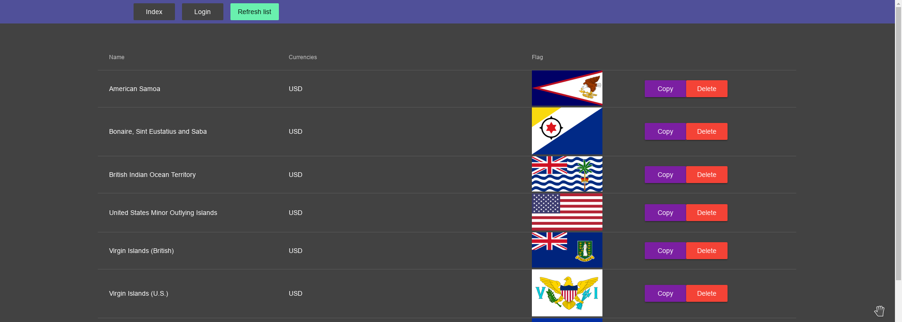
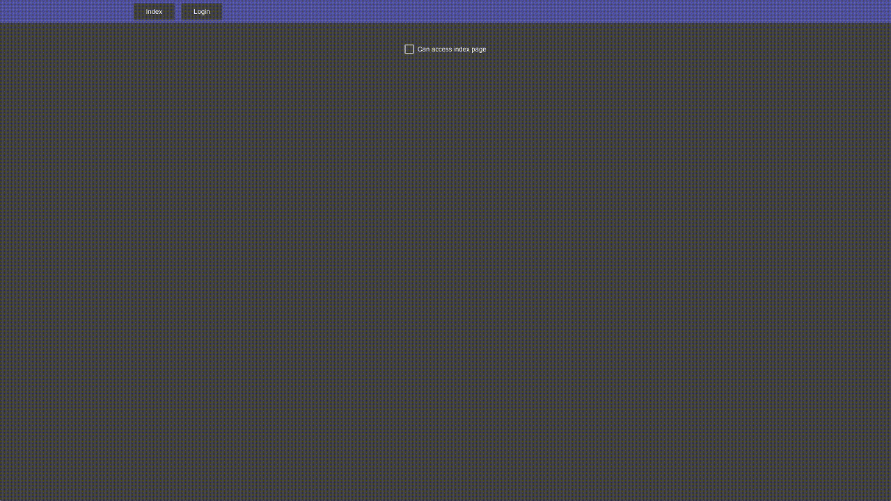

## Crate a Angular based system based on these rules
1. Create three components - header, index page, login page
2. Make header static so it is shown in both pages
   1. Add links to both pages in the header
3. Make index page accessible only when some type of trigger is active in login page (checkbox checked, form filled filled, etc.)
4. In index page request a list from - https://restcountries.eu/rest/v2/currency/usd
5. Add three actions for the list:
   1. copy - the list row that is copied is shown after the one you copied
   2. delete - the row will be removed from the list
   3. refresh - a single button that refreshes the whole list (so it is the same as the on requested on initial load)
6. Style the created items with angular material

## Example (it's more like inspiration and visual task representation)

### What to take in account
1. Correct Angular infrastructure usage
   1. routing
   2. access control
   3. component implementation
   4. state management
   5. data flow
   6. angular material usage
2. Clean code styling (spaces, new lines, variable placement, nesting, don't repeat yourself)
3. Appropriate HTML tag and attribute usage, logical class, id, etc. naming
4. Structured CSS
   * all corresponding styles ar written together
   * logical property sequence
5. JavaScript variable naming/declaration logic
6. clean and easy to read JavaScript functions (logically structured)